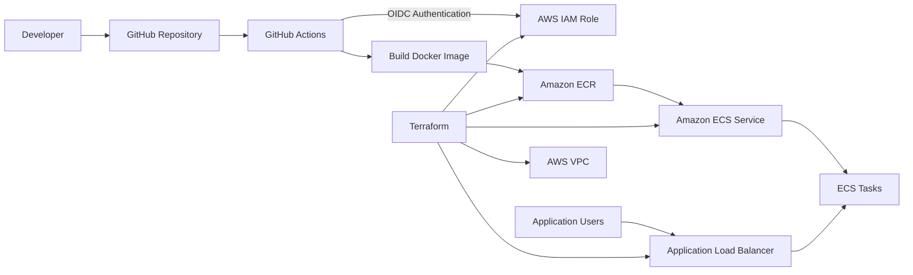
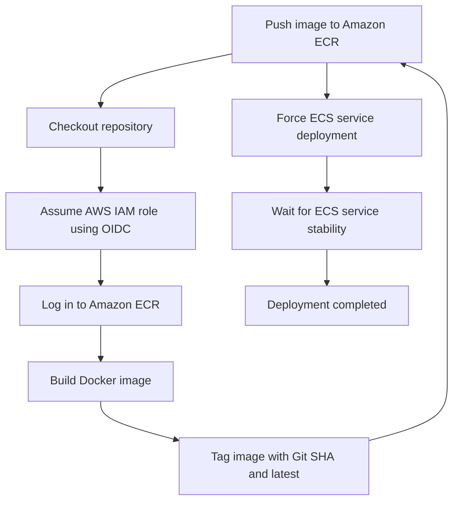

# AWS Production Platform

A production-style AWS platform that demonstrates cloud infrastructure engineering, Infrastructure as Code, containerized application deployment, secure CI/CD automation, and operational deployment practices.

This project provisions AWS infrastructure with Terraform, builds a Dockerized Python application, stores versioned container images in Amazon ECR, and automatically deploys updates to Amazon ECS through GitHub Actions.

---

## Project Overview

The platform includes:

* Modular Terraform infrastructure
* Amazon ECS container orchestration
* Amazon ECR image storage
* Application Load Balancer traffic routing
* Docker containerization
* GitHub Actions CI/CD
* GitHub OIDC authentication with AWS
* Immutable Docker image versioning
* Automated ECS service deployment
* ECS service stability verification

Every push to the `main` branch triggers the deployment workflow.

---

## Architecture



---

## CI/CD Deployment Flow



The workflow publishes each container image with two tags:

* `latest`
* The full Git commit SHA

Example:

```text
8c9182fbefdc781e28c59967a1605f19783f191b
latest
```

Git SHA tagging provides immutable deployment history and makes it possible to associate a deployed container image with the exact source-code revision that created it.

---

## Technology Stack

### AWS

* Amazon Elastic Container Service
* Amazon Elastic Container Registry
* Application Load Balancer
* AWS Identity and Access Management
* AWS Virtual Private Cloud
* Public and private subnets
* Internet Gateway
* NAT Gateway
* Security groups

### Infrastructure and DevOps

* Terraform
* Docker
* GitHub Actions
* GitHub OpenID Connect
* AWS CLI
* Git

### Application

* Python
* Flask

---

## Repository Structure

```text
aws-production-platform/
├── .github/
│   └── workflows/
│       └── deploy.yml
├── app/
│   ├── app.py
│   ├── Dockerfile
│   └── requirements.txt
├── docker/
├── terraform/
│   ├── backend.tf
│   ├── main.tf
│   ├── outputs.tf
│   ├── providers.tf
│   ├── variables.tf
│   ├── versions.tf
│   ├── environments/
│   │   └── dev/
│   └── modules/
│       ├── alb/
│       ├── ecr/
│       ├── ecs/
│       ├── ecs-service/
│       ├── github-oidc/
│       └── networking/
├── .gitignore
├── LICENSE
└── README.md
```

---

## Terraform Modules

The infrastructure is separated into reusable Terraform modules.

### Networking

The networking module manages:

* VPC
* Public and private subnets
* Internet Gateway
* NAT Gateway
* Route tables
* Security groups

### Application Load Balancer

The ALB module manages:

* Application Load Balancer
* Target groups
* Listener configuration
* Load balancer outputs

### Amazon ECR

The ECR module creates the container image repository used by the deployment pipeline.

### Amazon ECS

The ECS module creates the ECS cluster used to host the application.

### ECS Service

The ECS service module manages the application service, task deployment, networking integration, and load balancer attachment.

### GitHub OIDC

The GitHub OIDC module manages:

* AWS OIDC identity provider
* IAM deployment role
* GitHub Actions trust relationship
* Deployment permissions

This allows GitHub Actions to authenticate to AWS without storing permanent AWS access keys in GitHub.

---

## GitHub Actions Workflow

The deployment workflow runs when:

* Code is pushed to `main`
* The workflow is started manually through `workflow_dispatch`

The workflow performs the following steps:

1. Checks out the repository.
2. Requests a GitHub OIDC identity token.
3. Assumes the AWS deployment IAM role.
4. Confirms the active AWS identity.
5. Logs in to Amazon ECR.
6. Builds the Docker image.
7. Tags the image with `latest` and the Git commit SHA.
8. Pushes both tags to Amazon ECR.
9. Forces a new Amazon ECS deployment.
10. Waits until the ECS service reports a stable state.

---

## Security Design

This project uses several security-focused implementation choices.

### Keyless AWS Authentication

GitHub Actions uses OpenID Connect to assume an AWS IAM role.

No permanent AWS access key or secret access key is stored in the GitHub repository.

### Restricted Trust Relationship

The AWS IAM role trust policy restricts role assumption to the configured GitHub repository identity.

### Infrastructure as Code

Infrastructure is declared through Terraform, creating a version-controlled and repeatable configuration.

### Immutable Image Versioning

Container images are tagged with the complete Git commit SHA. This provides traceability between the application source code and the deployed image.

### Network Controls

Security groups control traffic between the load balancer and ECS workloads.

---

## Application Endpoints

The application exposes a main application endpoint and a health endpoint.

```text
/
```

Example response:

```json
{
  "application": "AWS Production Platform",
  "environment": "dev",
  "status": "running"
}
```

Health check:

```text
/health
```

Example response:

```json
{
  "status": "healthy"
}
```

---

## Deployment Verification

The platform has been successfully verified through:

* Successful GitHub Actions execution
* Successful AWS OIDC role assumption
* Docker image publication to Amazon ECR
* Git SHA and `latest` image tags
* Active ECS service
* Running ECS task
* Completed ECS deployment rollout
* Healthy Application Load Balancer target
* Successful application response
* Successful health endpoint response

---

## Local Application Testing

Build the application image:

```bash
docker build -t aws-production-platform ./app
```

Run the container:

```bash
docker run --rm -p 8080:8080 aws-production-platform
```

Test the application:

```bash
curl http://localhost:8080
```

Test the health endpoint:

```bash
curl http://localhost:8080/health
```

---

## Terraform Usage

Move into the Terraform directory:

```bash
cd terraform
```

Initialize Terraform:

```bash
terraform init
```

Review the proposed infrastructure changes:

```bash
terraform plan
```

Apply the infrastructure:

```bash
terraform apply
```

Review Terraform outputs:

```bash
terraform output
```

Destroy the infrastructure when it is no longer needed:

```bash
terraform destroy
```

> Review the Terraform plan carefully before applying or destroying infrastructure.

---

## Current Project Status

* [x] Modular Terraform configuration
* [x] VPC networking
* [x] Public and private subnets
* [x] Internet Gateway
* [x] NAT Gateway
* [x] Security groups
* [x] Application Load Balancer
* [x] Amazon ECR repository
* [x] Amazon ECS cluster
* [x] Amazon ECS service
* [x] Dockerized Python application
* [x] GitHub Actions deployment workflow
* [x] GitHub OIDC authentication
* [x] Git SHA image versioning
* [x] ECS deployment stability verification
* [x] Application health endpoint

---

## Roadmap

### Monitoring and Observability

* [ ] Add CloudWatch dashboard
* [ ] Add CloudWatch alarms
* [ ] Enable ECS Container Insights
* [ ] Add application metrics
* [ ] Add structured application logging

### Availability and Scaling

* [ ] Configure ECS Service Auto Scaling
* [ ] Run multiple ECS tasks
* [ ] Add CPU and memory scaling policies
* [ ] Test multi-Availability Zone resilience

### Security

* [ ] Add AWS WAF
* [ ] Add AWS Secrets Manager
* [ ] Add AWS KMS encryption
* [ ] Add automated vulnerability scanning
* [ ] Add security checks to the CI/CD workflow

### Terraform

* [ ] Configure production remote state
* [ ] Add state locking
* [ ] Add separate development, staging, and production configurations
* [ ] Add Terraform formatting and validation checks
* [ ] Add Terraform security scanning

### Deployment Strategy

* [ ] Add automated application tests
* [ ] Add deployment rollback logic
* [ ] Add blue/green deployment support
* [ ] Add deployment approval gates for production

---

## Skills Demonstrated

This project demonstrates practical experience with:

* AWS infrastructure architecture
* Terraform module development
* Infrastructure as Code
* Amazon ECS administration
* Amazon ECR image management
* Docker image creation
* Application Load Balancer configuration
* VPC networking
* IAM role and trust policy configuration
* GitHub Actions automation
* OpenID Connect federation
* CI/CD pipeline development
* Immutable artifact versioning
* Deployment troubleshooting
* YAML debugging
* AWS CLI validation
* Application health checks
* Cloud infrastructure documentation

---

## Troubleshooting Experience

Building this platform required diagnosing and resolving several real deployment issues, including:

* GitHub OIDC subject-claim mismatches
* IAM trust-policy failures
* GitHub Actions YAML indentation errors
* Missing environment variables
* Docker image-tagging problems
* ECR image verification
* ECS deployment stabilization
* Application health validation

These troubleshooting steps reflect the operational work required to build and maintain automated cloud platforms.

---

## Author

**Alexius Thomas**

Cloud Infrastructure Engineer | AWS Solutions Architect

* GitHub: [AlexiusThomas](https://github.com/AlexiusThomas)
* LinkedIn: [alexiusvictoria](https://www.linkedin.com/in/alexiusvictoria/)

---

## License

This project is licensed under the terms included in the [LICENSE](LICENSE) file.
